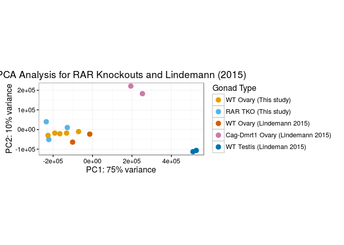
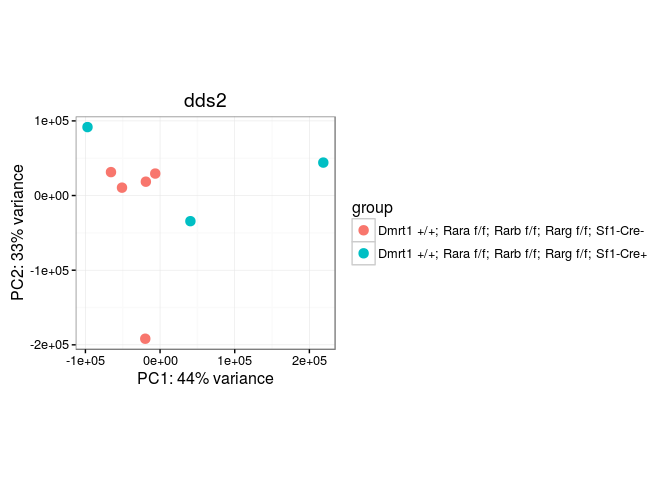
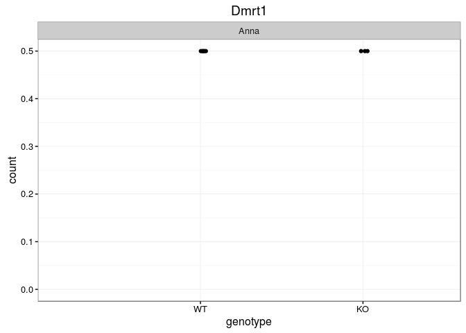
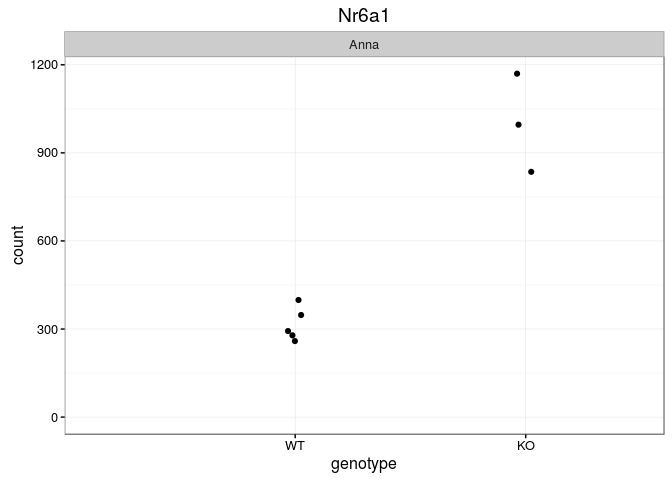
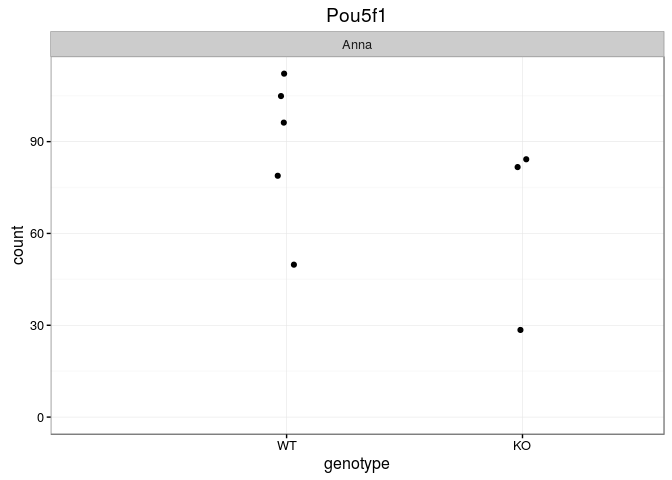
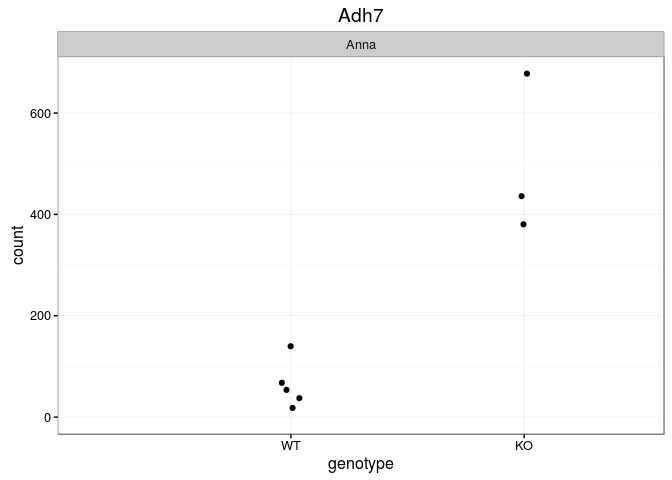
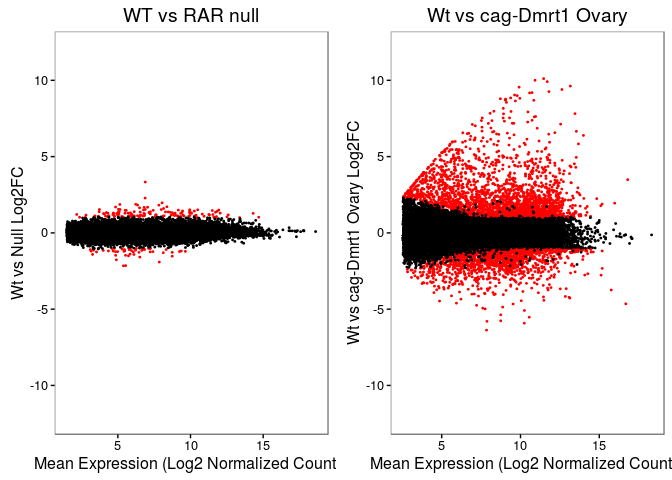
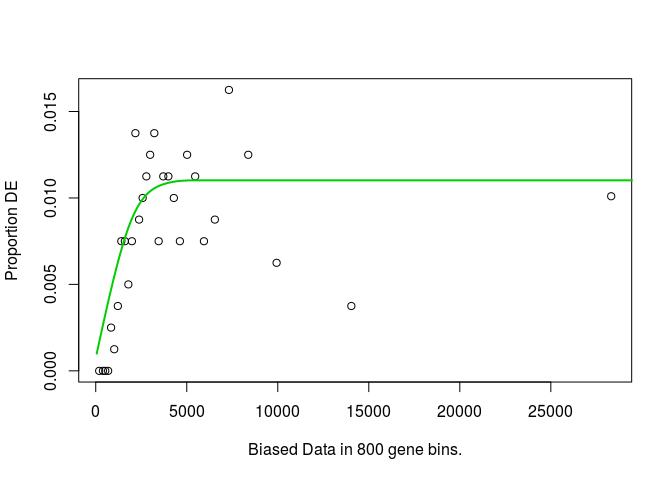
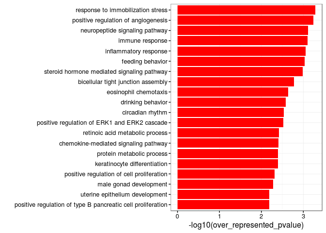

# rar_abg
Micah Gearhart  
1/27/2017  


```r
#bioconductor
library("GenomicFeatures")
library("BiocParallel")
library("Rsamtools")
library("GenomicAlignments")

#tidy
library("ggplot2")
library("gridExtra")
library("readr")
library("dplyr")
library("magrittr")
library("DESeq2")

library("xtable")

library("biomaRt")
library("goseq")

(ts<-format(Sys.time(), "%a_%b_%d_%Y_%H%M"))
cbPalette <- c("#999999", "#E69F00", "#56B4E9", "#009E73", "#F0E442", "#0072B2", "#D55E00", "#CC79A7")
```

## Define a helper function for viewing raw counts


```r
gg_plotCounts<-function(x="ENSMUSG00000024837",d=cds2) {
  if (substr(x,1,7)=="ENSMUSG") {
    title<-mgi[grep(x,mgi$ensembl_gene_id),"mgi_symbol"]
  } else {
    title<-x
    x<-mgi[grep(paste0("^",title,"$"),mgi$mgi_symbol),"ensembl_gene_id"]
  }
  
  plotCounts(d,x,intgroup=c("genotype","batch"),returnData=T) %>%
    ggplot(aes(x=genotype, y=count)) +
    geom_point(position=position_jitter(w=0.1,h=0)) + ggtitle(title) +
    expand_limits(x=0, y = 0) +
    facet_grid(~batch) +
    theme_bw()
}
```

## Download Curent Annotations from ENSEMBL

```r
listMarts(host="www.ensembl.org")
ensembl_87<-useMart(biomart="ENSEMBL_MART_ENSEMBL",host="www.ensembl.org", 
                    dataset="mmusculus_gene_ensembl")
txdb87<-makeTxDbFromBiomart(biomart="ENSEMBL_MART_ENSEMBL",host ="www.ensembl.org",
                            dataset="mmusculus_gene_ensembl",taxonomyId = "10090")
ens87<-exonsBy(txdb87,by="gene")
mgi <-  getBM(attributes = c("ensembl_gene_id", "mgi_id", "mgi_symbol"), filters = "ensembl_gene_id",
        values = names(ens87), mart = ensembl_87)
save(ens87,file="ens87_mouse.rdata")
save(mgi,file="mgi.rdata")
```

## summarizeOverlaps on HPC cluster

```r
load("ens87_mouse.rdata")

fls<-paste0("GRCm38/",c("7707_S27.Aligned.out.bam","7715_S30.Aligned.out.bam","7801_S23.Aligned.out.bam","7802_S26.Aligned.out.bam",
                        "7803_S24.Aligned.out.bam","7804_S20.Aligned.out.bam","7805_S21.Aligned.out.bam","7807_S25.Aligned.out.bam"))
(fls2 <- list.files("/home/bardwell/gearh006/dmrt1/ctv/mm10/GRCm38/ds", pattern=".bam$",full=TRUE))
bamlst <- BamFileList(c(fls,fls2),yieldSize=1e7)
register(MulticoreParam(workers=6))
genehits2 <- summarizeOverlaps(ens87,bamlst,mode="Union",singleEnd=FALSE,ignore.strand=TRUE)
save(genehits2,file=paste0("zarkowe0_RarVsCagDmrt1_ens87_",ts,".rdata"))
(n<-apply(assays(genehits)$counts,2,sum))
stopifnot(sum(n) > 0)
```

## Load in Annotations and Gene Counts

```r
load("ens87_mouse.rdata")
load("mgi.rdata")
#load("zarkowe0_RarVsCagDmrt1_ens87_Mon_Jan_23_2017_2323.rdata")
load("zarkowe0_RarVsCagDmrt1_ens87_Thu_Jan_26_2017_2027.rdata")
apply(assays(genehits2)$counts,2,sum)
```

```
## 7707_S27.Aligned.out.bam 7715_S30.Aligned.out.bam 7801_S23.Aligned.out.bam 
##                 23510876                 25343730                 24583829 
## 7802_S26.Aligned.out.bam 7803_S24.Aligned.out.bam 7804_S20.Aligned.out.bam 
##                 24173706                 25936769                 23802518 
## 7805_S21.Aligned.out.bam 7807_S25.Aligned.out.bam              dmf8_ds.bam 
##                 25926246                 24376476                 20606094 
##              dmf9_ds.bam              wtf6_ds.bam              wtf7_ds.bam 
##                 23102694                 24794466                 25063437 
##              wtm1_ds.bam              wtm2_ds.bam 
##                 22994578                 20068624
```

#Explore PCA

```r
dds<-DESeqDataSet(genehits2,design=~1)
colData(dds)$filename<-colnames(dds)
colData(dds)$sample<-sapply(strsplit(colnames(dds),"_"),function(x) x[1])
wt<-c("7802","7805","7707","7808","7804","7807")
ko<-c("7800","7801","7803","7715")


colData(dds)$genotype<-ifelse(colData(dds)$sample %in% wt,"WT",
                              ifelse(colData(dds)$sample %in% ko,"KO",
                              ifelse(colData(dds)$sample %in% c("dmf8","dmf9"),"cag-dmrt1",
                              ifelse(colData(dds)$sample %in% c("wtf6","wtf7"),"Ovary","Testis"))))
colData(dds)$batch<-c(rep("Anna",8),rep("Robin",6))

alleles<-c("Dmrt1 +/+; Rara f/f; Rarb f/f; Rarg f/f; Sf1-Cre-",
             "Dmrt1 +/+; Rara f/f; Rarb f/f; Rarg f/f; Sf1-Cre+",
             "Dmrt1 +/+; Rara f/f; Rarb f/f; Rarg f/f; Sf1-Cre+",
             "Dmrt1 +/+; Rara f/f; Rarb f/f; Rarg f/f; Sf1-Cre-",
             "Dmrt1 +/+; Rara f/f; Rarb f/f; Rarg f/f; Sf1-Cre+",
             "Dmrt1 +/+; Rara f/f; Rarb f/f; Rarg f/f; Sf1-Cre-",
             "Dmrt1 +/+; Rara f/f; Rarb f/f; Rarg f/f; Sf1-Cre-",
             "Dmrt1 +/+; Rara f/f; Rarb f/f; Rarg f/f; Sf1-Cre-")


names(alleles)<-c("7707","7715","7801","7802","7803","7804","7805","7807")
colData(dds)
```

```
## DataFrame with 14 rows and 4 columns
##                                          filename      sample    genotype
##                                       <character> <character> <character>
## 7707_S27.Aligned.out.bam 7707_S27.Aligned.out.bam        7707          WT
## 7715_S30.Aligned.out.bam 7715_S30.Aligned.out.bam        7715          KO
## 7801_S23.Aligned.out.bam 7801_S23.Aligned.out.bam        7801          KO
## 7802_S26.Aligned.out.bam 7802_S26.Aligned.out.bam        7802          WT
## 7803_S24.Aligned.out.bam 7803_S24.Aligned.out.bam        7803          KO
## ...                                           ...         ...         ...
## dmf9_ds.bam                           dmf9_ds.bam        dmf9   cag-dmrt1
## wtf6_ds.bam                           wtf6_ds.bam        wtf6       Ovary
## wtf7_ds.bam                           wtf7_ds.bam        wtf7       Ovary
## wtm1_ds.bam                           wtm1_ds.bam        wtm1      Testis
## wtm2_ds.bam                           wtm2_ds.bam        wtm2      Testis
##                                batch
##                          <character>
## 7707_S27.Aligned.out.bam        Anna
## 7715_S30.Aligned.out.bam        Anna
## 7801_S23.Aligned.out.bam        Anna
## 7802_S26.Aligned.out.bam        Anna
## 7803_S24.Aligned.out.bam        Anna
## ...                              ...
## dmf9_ds.bam                    Robin
## wtf6_ds.bam                    Robin
## wtf7_ds.bam                    Robin
## wtm1_ds.bam                    Robin
## wtm2_ds.bam                    Robin
```

```r
colData(dds)$alleles<-factor(alleles[colData(dds)$sample],
                             levels=c("Dmrt1 +/+; Rara f/f; Rarb f/f; Rarg f/f; Sf1-Cre-",
                                      "Dmrt1 +/+; Rara f/f; Rarb f/f; Rarg f/f; Sf1-Cre+"))

colData(dds)$genotype<-factor(colData(dds)$genotype,levels=c("WT","KO","Ovary","cag-dmrt1","Testis"))

g0<-plotPCA( DESeqTransform( dds ) ,intgroup = c("genotype"),ntop=100)+
  ggtitle("PCA Analysis for RAR Knockouts and Lindemann (2015)") + theme_bw() + 
  scale_color_manual(values=cbPalette[c(2,3,7,8,6)], name="Gonad Type", labels=c("WT Ovary (This study)","RAR TKO (This study)",
                        "WT Ovary (Lindemann 2015)","Cag-Dmrt1 Ovary (Lindemann 2015)","WT Testis (Lindeman 2015)"))
g0
```

<!-- -->

```r
ggsave(file=paste0("Figure_2B_",ts,".svg"),device = svglite::svglite,plot=g0,width=8,height=6)


dds2<-dds[,colData(dds)$sample %in% c("7802","7805","7707","7804","7807","7801","7803","7715")]

plotPCA( DESeqTransform( dds2 ) ,intgroup = c("alleles"),ntop=100)+
  ggtitle("dds2") + theme_bw()
```

<!-- -->

```r
#Explore rlog transformation
#ddsrl <- rlog(dds)
#plotPCA( ddsrl ,intgroup = c("genotype"),ntop=100)+
#  ggtitle("rlog dds") + theme_bw()

gg_plotCounts("Dmrt1",dds2)
```

<!-- -->

```r
gg_plotCounts("Nr6a1",dds2)
```

<!-- -->

```r
gg_plotCounts("Pou5f1",dds2)
```

<!-- -->

```r
gg_plotCounts("Adh7",dds2)
```

<!-- -->

## DESeq2


```r
colData(dds2)$genotype<-factor(colData(dds2)$genotype,levels=c("WT","KO"))
design(dds2)<-(~genotype)
dds2<-DESeq(dds2)
```

```
## estimating size factors
```

```
## estimating dispersions
```

```
## gene-wise dispersion estimates
```

```
## mean-dispersion relationship
```

```
## final dispersion estimates
```

```
## fitting model and testing
```

```r
resultsNames(dds2)
```

```
## [1] "Intercept"  "genotypeWT" "genotypeKO"
```

```r
summary(res<-results(dds2, contrast=c("genotype","KO","WT"),alpha=0.05,lfcThreshold = 0))
```

```
## 
## out of 34708 with nonzero total read count
## adjusted p-value < 0.05
## LFC > 0 (up)     : 191, 0.55% 
## LFC < 0 (down)   : 91, 0.26% 
## outliers [1]     : 263, 0.76% 
## low counts [2]   : 11140, 32% 
## (mean count < 2)
## [1] see 'cooksCutoff' argument of ?results
## [2] see 'independentFiltering' argument of ?results
```

```r
table(res$padj < 0.05)
```

```
## 
## FALSE  TRUE 
## 23023   282
```

```r
idx<-match(rownames(res),mgi$ensembl_gene_id)
res$mgi<-mgi[idx,"mgi_symbol"]
res<-res[with(res,order(padj)),]
head(res)
```

```
## log2 fold change (MAP): genotype KO vs WT 
## Wald test p-value: genotype KO vs WT 
## DataFrame with 6 rows and 7 columns
##                     baseMean log2FoldChange     lfcSE      stat
##                    <numeric>      <numeric> <numeric> <numeric>
## ENSMUSG00000021953 117.65804       3.333342 0.2339646 14.247208
## ENSMUSG00000063972 571.88673       1.496924 0.1907026  7.849519
## ENSMUSG00000073530 116.82649       2.283868 0.3136834  7.280804
## ENSMUSG00000109372  41.30690      -2.156994 0.2964674 -7.275654
## ENSMUSG00000049608  45.89336      -2.143973 0.3025762 -7.085729
## ENSMUSG00000016349  34.74023       1.865866 0.2786585  6.695890
##                          pvalue         padj         mgi
##                       <numeric>    <numeric> <character>
## ENSMUSG00000021953 4.665677e-46 1.087336e-41         Tdh
## ENSMUSG00000063972 4.176344e-15 4.866484e-11       Nr6a1
## ENSMUSG00000073530 3.318366e-13 2.008579e-09      Pappa2
## ENSMUSG00000109372 3.447465e-13 2.008579e-09     Gm19410
## ENSMUSG00000049608 1.383140e-12 6.446815e-09       Gpr55
## ENSMUSG00000016349 2.143628e-11 8.326207e-08      Eef1a2
```

```r
#plotMA(res, alpha=0.05, ylim=c(-12,12))

res<-res[with(res,order(padj)),]
head(res)
```

```
## log2 fold change (MAP): genotype KO vs WT 
## Wald test p-value: genotype KO vs WT 
## DataFrame with 6 rows and 7 columns
##                     baseMean log2FoldChange     lfcSE      stat
##                    <numeric>      <numeric> <numeric> <numeric>
## ENSMUSG00000021953 117.65804       3.333342 0.2339646 14.247208
## ENSMUSG00000063972 571.88673       1.496924 0.1907026  7.849519
## ENSMUSG00000073530 116.82649       2.283868 0.3136834  7.280804
## ENSMUSG00000109372  41.30690      -2.156994 0.2964674 -7.275654
## ENSMUSG00000049608  45.89336      -2.143973 0.3025762 -7.085729
## ENSMUSG00000016349  34.74023       1.865866 0.2786585  6.695890
##                          pvalue         padj         mgi
##                       <numeric>    <numeric> <character>
## ENSMUSG00000021953 4.665677e-46 1.087336e-41         Tdh
## ENSMUSG00000063972 4.176344e-15 4.866484e-11       Nr6a1
## ENSMUSG00000073530 3.318366e-13 2.008579e-09      Pappa2
## ENSMUSG00000109372 3.447465e-13 2.008579e-09     Gm19410
## ENSMUSG00000049608 1.383140e-12 6.446815e-09       Gpr55
## ENSMUSG00000016349 2.143628e-11 8.326207e-08      Eef1a2
```

```r
dim(res_temp<-subset(res,padj<0.05))
```

```
## [1] 282   7
```

```r
table(abs(res_temp$log2FoldChange) > 1)
```

```
## 
## FALSE  TRUE 
##    96   186
```

```r
table(res_temp$log2FoldChange > 0)
```

```
## 
## FALSE  TRUE 
##    91   191
```

```r
#subset to abs(log2FC) > 1
res_temp<-res_temp[abs(res_temp$log2FoldChange) > 1,]


# Genes with missing symbols
res_temp[res_temp$mgi=="",]
```

```
## log2 fold change (MAP): genotype KO vs WT 
## Wald test p-value: genotype KO vs WT 
## DataFrame with 2 rows and 7 columns
##                     baseMean log2FoldChange     lfcSE      stat
##                    <numeric>      <numeric> <numeric> <numeric>
## ENSMUSG00000111640 331.48043       1.713243 0.3136261  5.462691
## ENSMUSG00000098411  69.37138       1.392567 0.3123516  4.458332
##                          pvalue         padj         mgi
##                       <numeric>    <numeric> <character>
## ENSMUSG00000111640 4.689710e-08 4.967895e-05            
## ENSMUSG00000098411 8.259984e-06 2.162909e-03
```

```r
#http://useast.ensembl.org/Mus_musculus/Gene/Summary?db=core;g=ENSMUSG00000111640;r=CHR_MG153_PATCH:4061447-4061762;t=ENSMUST00000216743
res_temp["ENSMUSG00000111640","mgi"] <-"AC109138.6"

#ENSMUSG00000098411 is an alternative assembly allele for Dlk1 with is already on the list so we can omit the gene
res_temp<-res_temp[rownames(res_temp)!="ENSMUSG00000098411",]

write.csv(res_temp,paste0("Supplmentary_Table_1_",ts,".csv"),quote=F)
```

## Export for Latex via xtable

```r
dim(res_temp_up<-as.data.frame(res_temp[res_temp$log2FoldChange > 0,c("mgi","log2FoldChange","padj")]))
```

```
## [1] 136   3
```

```r
dim(res_temp_down<-as.data.frame(res_temp[res_temp$log2FoldChange < 0,c("mgi","log2FoldChange","padj")]))
```

```
## [1] 49  3
```

```r
colnames(res_temp_up)<-c("Gene","log2FC","Adjusted p-value")
colnames(res_temp_down)<-c("Gene","log2FC","Adjusted p-value")

xtmp1<-xtable(res_temp_up[1:68,])
digits(xtmp1)<-c(0,0,2,-2)
print(xtmp1, file="tu1.tex", floating=FALSE,include.rownames=FALSE)

xtmp2<-xtable(res_temp_up[69:136,])
digits(xtmp2)<-c(0,0,2,-2)
print(xtmp2, file="tu2.tex", floating=FALSE,include.rownames=FALSE)

xtmp4<-xtable(res_temp_down)
digits(xtmp4)<-c(0,0,2,-2)
print(xtmp4, file="td1.tex", floating=FALSE,include.rownames=FALSE)

system("pdflatex test6.tex")
system(paste0("mv test6.pdf ","Supplmentary_Table_1_",ts,".pdf"))
```

## MA plot for RAR KO data

```r
g1<-res %>%
  as.data.frame() %>% 
  mutate(deg=padj<0.05 & abs(log2FoldChange) > 1) %>% 
  mutate(x=log2(baseMean+0.5)) %>% 
  filter(!(is.na(padj) | is.na(log2FoldChange))) %>% 
  ggplot(aes(x=x,y=log2FoldChange,color=deg)) + 
  ggtitle("WT vs RAR null") + ylim(c(-12,12)) +
  xlab("Mean Expression (Log2 Normalized Counts)") + ylab("Wt vs Null Log2FC") +
  scale_color_manual(values=c("black","red")) +
  geom_point(size=0.35)+theme_bw() + theme(panel.grid.major=element_blank(),panel.grid.minor=element_blank()) +
  theme(legend.position="none")

#ggsave(file=paste0("Figure_2B_",ts,".svg"),device = svglite::svglite,plot=g1,width=6,height=8.5)
```


## Calculate Differentially expressed Genes for Cag-dmrt1 Overexpression


```r
colData(dds4<-dds[,9:12])
```

```
## DataFrame with 4 rows and 5 columns
##                filename      sample  genotype       batch  alleles
##             <character> <character>  <factor> <character> <factor>
## dmf8_ds.bam dmf8_ds.bam        dmf8 cag-dmrt1       Robin       NA
## dmf9_ds.bam dmf9_ds.bam        dmf9 cag-dmrt1       Robin       NA
## wtf6_ds.bam wtf6_ds.bam        wtf6     Ovary       Robin       NA
## wtf7_ds.bam wtf7_ds.bam        wtf7     Ovary       Robin       NA
```

```r
colData(dds4)$genotype<-factor(colData(dds4)$genotype,levels=c("Ovary","cag-dmrt1"))
design(dds4)<-(~genotype)
dds4<-DESeq(dds4)
```

```
## estimating size factors
```

```
## estimating dispersions
```

```
## gene-wise dispersion estimates
```

```
## mean-dispersion relationship
```

```
## final dispersion estimates
```

```
## fitting model and testing
```

```r
resultsNames(dds4)
```

```
## [1] "Intercept"         "genotypeOvary"     "genotypecag.dmrt1"
```

```r
summary(res_cag<-results(dds4, contrast=c("genotype","cag.dmrt1","Ovary"),alpha=0.05,lfcThreshold = 0))
```

```
## 
## out of 32929 with nonzero total read count
## adjusted p-value < 0.05
## LFC > 0 (up)     : 3292, 10% 
## LFC < 0 (down)   : 2783, 8.5% 
## outliers [1]     : 0, 0% 
## low counts [2]   : 11795, 36% 
## (mean count < 5)
## [1] see 'cooksCutoff' argument of ?results
## [2] see 'independentFiltering' argument of ?results
```

```r
table(res_cag$padj < 0.05)
```

```
## 
## FALSE  TRUE 
## 15059  6075
```

```r
idx<-match(rownames(res_cag),mgi$ensembl_gene_id)
res_cag$mgi<-mgi[idx,"mgi_symbol"]
res_cag<-res_cag[with(res_cag,order(padj)),]
head(res_cag)
```

```
## log2 fold change (MAP): genotype cag.dmrt1 vs Ovary 
## Wald test p-value: genotype cag.dmrt1 vs Ovary 
## DataFrame with 6 rows and 7 columns
##                     baseMean log2FoldChange     lfcSE      stat
##                    <numeric>      <numeric> <numeric> <numeric>
## ENSMUSG00000091556  9171.565       9.624873 0.3222667  29.86617
## ENSMUSG00000031430  3580.198       9.260344 0.3726593  24.84936
## ENSMUSG00000068522 16331.825       6.390131 0.2580444  24.76369
## ENSMUSG00000027445  6343.285       9.399984 0.3860070  24.35185
## ENSMUSG00000045330  3322.704       9.915859 0.4447048  22.29762
## ENSMUSG00000030428  4643.955       6.569176 0.2960575  22.18885
##                           pvalue          padj           mgi
##                        <numeric>     <numeric>   <character>
## ENSMUSG00000091556 5.413955e-196 1.144185e-191       Gm14569
## ENSMUSG00000031430 2.627357e-136 2.776328e-132         Vsig1
## ENSMUSG00000068522 2.208104e-135 1.555536e-131          Aard
## ENSMUSG00000027445 5.541232e-131 2.927710e-127          Cst9
## ENSMUSG00000045330 3.896882e-110 1.647134e-106 4933402E13Rik
## ENSMUSG00000030428 4.400950e-109 1.550161e-105         Ttyh1
```

```r
#plotMA(res_cag, alpha=0.05, ylim=c(-12,12))

g3<-res_cag %>%
  as.data.frame() %>% 
  mutate(deg=padj<0.05 & abs(log2FoldChange) > 1) %>% 
  mutate(x=log2(baseMean+0.5)) %>% 
  filter(!(is.na(padj) | is.na(log2FoldChange))) %>% 
  ggplot(aes(x=x,y=log2FoldChange,color=deg)) + 
  ggtitle("Wt vs cag-Dmrt1 Ovary") + ylim(c(-12,12)) +
  xlab("Mean Expression (Log2 Normalized Counts)") + ylab("Wt vs cag-Dmrt1 Ovary Log2FC") +
  scale_color_manual(values=c("black","red")) +
  geom_point(size=0.35)+theme_bw() + theme(panel.grid.major=element_blank(),panel.grid.minor=element_blank()) +
  theme(legend.position="none")

grid.arrange(g1,g3,ncol=2)
```

<!-- -->

```r
pdf(file=paste0("Figure_2C_",ts,".pdf"),width=8,height=5)
grid.arrange(g1,g3,ncol=2)
dev.off()
```

```
## png 
##   2
```

```r
#ggsave(file=paste0("Figure_2C_",ts,".svg"),device = svglite::svglite,plot=g3,width=6,height=8.5)
```


#GO terms


```r
length(expressed_genes<-unique(c(rownames(res[res$baseMean > 1 & !is.na(res$log2FoldChange) & !is.na(res$padj),]),
                                 rownames(res_cag[res_cag$baseMean > 1 & !is.na(res_cag$log2FoldChange) & !is.na(res_cag$padj),]))))
```

```
## [1] 24099
```

```r
mgi_go<-readr::read_delim("/mnt/gcd/go/gene_association.mgi",delim="\t",skip=24,col_names=F)

colnames(mgi_go)<-c("DB","DB Object ID","Mgi Symbol","Qualifier","GO ID","DB:eEference","Evidence Code",
                    "WithorFrom","Aspect","DB Object Name","DB Object Syn","DB Object Type","Taxon","Date","Assigned By",
                    "Annotation Extension","Gene Product Form ID")
table(mgi_go$`Evidence Code`)
```

```
## 
##    EXP    IBA     IC    IDA    IEA    IEP    IGI    IKR    IMP    IPI 
##     47  30071    544  47121  82502    552   8371      7  37781  13363 
##    ISA    ISM    ISO    ISS    NAS     ND    RCA    TAS 
##   5385     24 110326   1782    663  21335     99   2924
```

```r
#high quality?  
#dim(mgi_go<-mgi_go[mgi_go$`Evidence Code` %in% c("EXP","IDA","IEP","IGI","IMP","IPI","ISS","TAS"),])

summary(idx<-match(mgi_go$`DB Object ID`,mgi$mgi_id))
```

```
##    Min. 1st Qu.  Median    Mean 3rd Qu.    Max.    NA's 
##       1   11820   23260   23280   34560   49670    4628
```

```r
mgi_go$ensembl<-mgi[idx,"ensembl_gene_id"]

dim(mgi_go<-mgi_go[!is.na(mgi_go$ensembl),c("ensembl","GO ID")])
```

```
## [1] 358269      2
```

```r
#subset to BP
mgi_goterms<-readr::read_delim("/mnt/gcd/go/go_terms.mgi",delim="\t",col_names=F)
colnames(mgi_goterms)<-c("Category","GO ID","Description")
table(mgi_goterms$Category)
```

```
## 
## Biological Process Cellular Component Molecular Function 
##              11417               1539               3987
```

```r
dim(mgi_BP_goterms<-mgi_goterms[mgi_goterms$Category=="Biological Process","GO ID"])
```

```
## [1] 11417     1
```

```r
dim(mgi_go<-mgi_go[mgi_go$`GO ID` %in% mgi_BP_goterms$`GO ID`,])
```

```
## [1] 155618      2
```

```r
dim(mgi_go<-mgi_go[mgi_go$ensembl %in% expressed_genes,])
```

```
## [1] 134793      2
```

```r
#remove duplicated entries (possibly from multiple lines of evidence)
dim(mgi_go<-mgi_go[!duplicated(mgi_go),])
```

```
## [1] 114211      2
```

```r
mgi_go.list<-split(mgi_go$`GO ID`,mgi_go$ensembl)

mgi[grep("Dmrt1",mgi$mgi_symbol),]
```

```
##          ensembl_gene_id      mgi_id mgi_symbol
## 21575 ENSMUSG00000024837 MGI:1354733      Dmrt1
## 23452 ENSMUSG00000104600 MGI:4887388     Dmrt1i
```

```r
mgi_go.list[["ENSMUSG00000024837"]] # not express in ovary
```

```
##  [1] "GO:0000122" "GO:0000902" "GO:0002176" "GO:0003006" "GO:0006351"
##  [6] "GO:0006355" "GO:0007275" "GO:0007283" "GO:0007548" "GO:0008354"
## [11] "GO:0008584" "GO:0030154" "GO:0030238" "GO:0035556" "GO:0045835"
## [16] "GO:0045840" "GO:0045944" "GO:0046661" "GO:0048599" "GO:0060008"
## [21] "GO:0060009" "GO:0060903" "GO:1900107" "GO:2000020"
```

```r
mgi[grep("Foxl2",mgi$mgi_symbol),]
```

```
##          ensembl_gene_id      mgi_id mgi_symbol
## 11582 ENSMUSG00000097072 MGI:3614944    Foxl2os
## 11636 ENSMUSG00000050397 MGI:1349428      Foxl2
```

```r
mgi_go.list[["ENSMUSG00000050397"]]
```

```
##  [1] "GO:0000122" "GO:0001541" "GO:0002074" "GO:0006309" "GO:0006351"
##  [6] "GO:0006355" "GO:0006366" "GO:0007338" "GO:0008585" "GO:0019101"
## [11] "GO:0030154" "GO:0033686" "GO:0042703" "GO:0043065" "GO:0043280"
## [16] "GO:0045892" "GO:0045944" "GO:0046881" "GO:0048048" "GO:0060014"
## [21] "GO:0060065"
```

```r
#View(mgi_goterms[mgi_goterms$`GO ID` %in% mgi_go.list[["ENSMUSG00000024837"]],])
#View(mgi_goterms[mgi_goterms$`GO ID` %in% mgi_go.list[["ENSMUSG00000050397"]],])


mgi[mgi$ensembl_gene_id %in% mgi_go[grep("GO:0030238",mgi_go$`GO ID`),"ensembl"]$ensembl,]
```

```
##          ensembl_gene_id      mgi_id mgi_symbol
## 2958  ENSMUSG00000000567   MGI:98371       Sox9
## 6172  ENSMUSG00000021974  MGI:104723       Fgf9
## 8457  ENSMUSG00000024949 MGI:1095403        Sf1
## 9063  ENSMUSG00000005534   MGI:96575       Insr
## 15917 ENSMUSG00000005640 MGI:1346037      Insrr
## 18009 ENSMUSG00000025056 MGI:1352460      Nr0b1
## 21575 ENSMUSG00000024837 MGI:1354733      Dmrt1
## 28328 ENSMUSG00000034460  MGI:106034       Six4
## 38601 ENSMUSG00000005533   MGI:96433      Igf1r
## 45944 ENSMUSG00000023000   MGI:94891        Dhh
## 49020 ENSMUSG00000015812   MGI:95789      Gnrh1
```

```r
#bias.data
bd<-sum(width(reduce(ens87)))
bd["ENSMUSG00000024837"]
```

```
## ENSMUSG00000024837 
##               2594
```

```r
bd<-bd[names(bd) %in% expressed_genes]
head(bd)
```

```
## ENSMUSG00000000001 ENSMUSG00000000028 ENSMUSG00000000031 
##               3262               2252               2372 
## ENSMUSG00000000037 ENSMUSG00000000049 ENSMUSG00000000056 
##               6079               1594               4806
```

```r
temp<-res[expressed_genes,]
temp_deg<-subset(temp,temp$padj < 0.05 & abs(temp$log2FoldChange ) > 1)
degs<-as.numeric(rownames(temp) %in% rownames(temp_deg))
names(degs)<-rownames(temp)
table(degs)
```

```
## degs
##     0     1 
## 23913   186
```

```r
pwf<-nullp(degs,bias.data=bd)
```

```
## Warning in pcls(G): initial point very close to some inequality constraints
```

<!-- -->

```r
GO.wall<-goseq(pwf,gene2cat=mgi_go.list)
```

```
## Using manually entered categories.
```

```
## For 7039 genes, we could not find any categories. These genes will be excluded.
```

```
## To force their use, please run with use_genes_without_cat=TRUE (see documentation).
```

```
## This was the default behavior for version 1.15.1 and earlier.
```

```
## Calculating the p-values...
```

```
## 'select()' returned 1:1 mapping between keys and columns
```

```r
GO.wall[1:20,c("category","term","numDEInCat","numInCat")]
```

```
##         category
## 4715  GO:0035902
## 5850  GO:0045766
## 1675  GO:0007218
## 1516  GO:0006955
## 1515  GO:0006954
## 1820  GO:0007631
## 5375  GO:0043401
## 8136  GO:0070830
## 6297  GO:0048245
## 5200  GO:0042756
## 1814  GO:0007623
## 8031  GO:0070374
## 5150  GO:0042573
## 7927  GO:0070098
## 2983  GO:0019538
## 3367  GO:0030216
## 1865  GO:0008284
## 1893  GO:0008584
## 4696  GO:0035847
## 10247 GO:1904692
##                                                              term
## 4715                            response to immobilization stress
## 5850                          positive regulation of angiogenesis
## 1675                               neuropeptide signaling pathway
## 1516                                              immune response
## 1515                                        inflammatory response
## 1820                                             feeding behavior
## 5375                   steroid hormone mediated signaling pathway
## 8136                           bicellular tight junction assembly
## 6297                                        eosinophil chemotaxis
## 5200                                            drinking behavior
## 1814                                             circadian rhythm
## 8031                 positive regulation of ERK1 and ERK2 cascade
## 5150                              retinoic acid metabolic process
## 7927                         chemokine-mediated signaling pathway
## 2983                                    protein metabolic process
## 3367                                 keratinocyte differentiation
## 1865                    positive regulation of cell proliferation
## 1893                                       male gonad development
## 4696                               uterine epithelium development
## 10247 positive regulation of type B pancreatic cell proliferation
##       numDEInCat numInCat
## 4715           2        4
## 5850           6      111
## 1675           4       46
## 1516           7      158
## 1515           9      272
## 1820           3       20
## 5375           4       50
## 8136           3       23
## 6297           2        8
## 5200           2        9
## 1814           4       66
## 8031           6      158
## 5150           2       11
## 7927           3       35
## 2983           2       12
## 3367           3       35
## 1865          10      415
## 1893           4       75
## 4696           1        1
## 10247          1        1
```

```r
head(GO.wall,20) %>%
  dplyr::mutate(term=factor(term,levels=rev(term))) %>%
ggplot(aes(x=term,y=-log10(over_represented_pvalue))) +
  geom_bar(stat="identity",fill="red") +
  coord_flip() + xlab("") +
  theme_bw() 
```

<!-- -->

```r
listGO<-function(goid) {
  print(mgi_goterms[grep(goid,mgi_goterms$`GO ID`),])
  tg<-mgi_go[grep(goid,mgi_go$`GO ID`),"ensembl"]
  idx<-match(tg$ensembl,mgi$ensembl_gene_id)
  tg$symbol<-mgi[idx,"mgi_symbol"]
  tg$deg<-degs[tg$ensembl]
  as.data.frame(tg)
}

listGO("GO:0008584") #male gonad development:  GO:0008584
```

```
## # A tibble: 1 x 3
##             Category      GO ID            Description
##                <chr>      <chr>                  <chr>
## 1 Biological Process GO:0008584 male gonad development
```

```
##               ensembl  symbol deg
## 1  ENSMUSG00000052155  Acvr2a   0
## 2  ENSMUSG00000042500    Ago4   0
## 3  ENSMUSG00000022868    Ahsg   1
## 4  ENSMUSG00000046532      Ar   0
## 5  ENSMUSG00000019947  Arid5b   0
## 6  ENSMUSG00000033952    Aspm   0
## 7  ENSMUSG00000004263    Atn1   0
## 8  ENSMUSG00000003873     Bax   0
## 9  ENSMUSG00000057329    Bcl2   0
## 10 ENSMUSG00000007659  Bcl2l1   0
## 11 ENSMUSG00000027381 Bcl2l11   0
## 12 ENSMUSG00000016758     Bik   0
## 13 ENSMUSG00000034329   Brip1   0
## 14 ENSMUSG00000039910  Cited2   0
## 15 ENSMUSG00000024837   Dmrt1   0
## 16 ENSMUSG00000074656  Eif2s2   0
## 17 ENSMUSG00000003549   Ercc1   0
## 18 ENSMUSG00000019768    Esr1   0
## 19 ENSMUSG00000032815   Fanca   0
## 20 ENSMUSG00000021974    Fgf9   0
## 21 ENSMUSG00000031162   Gata1   0
## 22 ENSMUSG00000015619   Gata3   0
## 23 ENSMUSG00000021944   Gata4   0
## 24 ENSMUSG00000016559   H3f3b   0
## 25 ENSMUSG00000056758   Hmga2   0
## 26 ENSMUSG00000054717   Hmgb2   0
## 27 ENSMUSG00000000938  Hoxa10   0
## 28 ENSMUSG00000038227   Hoxa9   0
## 29 ENSMUSG00000032968    Inha   0
## 30 ENSMUSG00000041324   Inhba   0
## 31 ENSMUSG00000079019   Insl3   0
## 32 ENSMUSG00000050957   Insl6   0
## 33 ENSMUSG00000005534    Insr   0
## 34 ENSMUSG00000037876  Jmjd1c   0
## 35 ENSMUSG00000062960     Kdr   0
## 36 ENSMUSG00000001558  Klhl10   0
## 37 ENSMUSG00000024107   Lhcgr   0
## 38 ENSMUSG00000019230    Lhx9   0
## 39 ENSMUSG00000024151    Msh2   0
## 40 ENSMUSG00000025056   Nr0b1   1
## 41 ENSMUSG00000026751   Nr5a1   0
## 42 ENSMUSG00000030717   Nupr1   0
## 43 ENSMUSG00000020453   Patz1   0
## 44 ENSMUSG00000025289   Prdx4   0
## 45 ENSMUSG00000037992    Rara   0
## 46 ENSMUSG00000024990    Rbp4   0
## 47 ENSMUSG00000021589 Rhobtb3   0
## 48 ENSMUSG00000021872 Rnase10   0
## 49 ENSMUSG00000053368   Rxfp2   0
## 50 ENSMUSG00000031548   Sfrp1   0
## 51 ENSMUSG00000027996   Sfrp2   1
## 52 ENSMUSG00000034460    Six4   0
## 53 ENSMUSG00000024515   Smad4   0
## 54 ENSMUSG00000024176    Sox8   0
## 55 ENSMUSG00000000567    Sox9   0
## 56 ENSMUSG00000053030  Spink2   0
## 57 ENSMUSG00000038541  Srd5a2   0
## 58 ENSMUSG00000027465 Tbc1d20   0
## 59 ENSMUSG00000009670   Tex11   0
## 60 ENSMUSG00000039329 Tex19.1   0
## 61 ENSMUSG00000039239   Tgfb2   0
## 62 ENSMUSG00000007613  Tgfbr1   0
## 63 ENSMUSG00000030059    Tmf1   0
## 64 ENSMUSG00000031329     Tsx   0
## 65 ENSMUSG00000019505     Ubb   0
## 66 ENSMUSG00000032512   Wdr48   0
## 67 ENSMUSG00000036856    Wnt4   0
## 68 ENSMUSG00000021994   Wnt5a   0
## 69 ENSMUSG00000016458     Wt1   0
## 70 ENSMUSG00000030189    Ybx3   0
## 71 ENSMUSG00000027570  Col9a3   0
## 72 ENSMUSG00000022375   Lrrc6   0
## 73 ENSMUSG00000070645    Ren1   1
## 74 ENSMUSG00000022061  Nkx3-1   0
## 75 ENSMUSG00000029359    Tesc   0
```

```r
listGO("GO:0042573") #retinoic acid metabolic process
```

```
## # A tibble: 1 x 3
##             Category      GO ID                     Description
##                <chr>      <chr>                           <chr>
## 1 Biological Process GO:0042573 retinoic acid metabolic process
```

```
##               ensembl  symbol deg
## 1  ENSMUSG00000074207    Adh1   0
## 2  ENSMUSG00000055301    Adh7   1
## 3  ENSMUSG00000053279 Aldh1a1   0
## 4  ENSMUSG00000013584 Aldh1a2   0
## 5  ENSMUSG00000015134 Aldh1a3   0
## 6  ENSMUSG00000024747 Aldh1a7   0
## 7  ENSMUSG00000032066    Bco2   0
## 8  ENSMUSG00000004885  Crabp2   0
## 9  ENSMUSG00000024987 Cyp26a1   1
## 10 ENSMUSG00000063415 Cyp26b1   0
## 11 ENSMUSG00000046402    Rbp1   0
```

```r
listGO("GO:0043401") #steroid hormone mediated signaling pathway
```

```
## # A tibble: 1 x 3
##             Category      GO ID                                Description
##                <chr>      <chr>                                      <chr>
## 1 Biological Process GO:0043401 steroid hormone mediated signaling pathway
```

```
##               ensembl symbol deg
## 1  ENSMUSG00000039202  Abhd2   1
## 2  ENSMUSG00000046532     Ar   0
## 3  ENSMUSG00000021835   Bmp4   0
## 4  ENSMUSG00000008999   Bmp7   0
## 5  ENSMUSG00000019768   Esr1   0
## 6  ENSMUSG00000021055   Esr2   0
## 7  ENSMUSG00000024955  Esrra   0
## 8  ENSMUSG00000021255  Esrrb   0
## 9  ENSMUSG00000026610  Esrrg   0
## 10 ENSMUSG00000053647  Gper1   0
## 11 ENSMUSG00000017950  Hnf4a   0
## 12 ENSMUSG00000025056  Nr0b1   1
## 13 ENSMUSG00000037583  Nr0b2   0
## 14 ENSMUSG00000020889  Nr1d1   1
## 15 ENSMUSG00000021775  Nr1d2   0
## 16 ENSMUSG00000060601  Nr1h2   0
## 17 ENSMUSG00000002108  Nr1h3   0
## 18 ENSMUSG00000047638  Nr1h4   0
## 19 ENSMUSG00000022809  Nr1i2   0
## 20 ENSMUSG00000005897  Nr2c1   0
## 21 ENSMUSG00000005893  Nr2c2   0
## 22 ENSMUSG00000019803  Nr2e1   0
## 23 ENSMUSG00000032292  Nr2e3   0
## 24 ENSMUSG00000069171  Nr2f1   0
## 25 ENSMUSG00000030551  Nr2f2   0
## 26 ENSMUSG00000002393  Nr2f6   0
## 27 ENSMUSG00000024431  Nr3c1   0
## 28 ENSMUSG00000031618  Nr3c2   0
## 29 ENSMUSG00000023034  Nr4a1   0
## 30 ENSMUSG00000026826  Nr4a2   0
## 31 ENSMUSG00000028341  Nr4a3   0
## 32 ENSMUSG00000026751  Nr5a1   0
## 33 ENSMUSG00000026398  Nr5a2   0
## 34 ENSMUSG00000063972  Nr6a1   1
## 35 ENSMUSG00000031870    Pgr   0
## 36 ENSMUSG00000022383  Ppara   0
## 37 ENSMUSG00000002250  Ppard   0
## 38 ENSMUSG00000000440  Pparg   0
## 39 ENSMUSG00000037992   Rara   0
## 40 ENSMUSG00000017491   Rarb   0
## 41 ENSMUSG00000001288   Rarg   0
## 42 ENSMUSG00000032238   Rora   0
## 43 ENSMUSG00000036192   Rorb   0
## 44 ENSMUSG00000028150   Rorc   0
## 45 ENSMUSG00000015846   Rxra   0
## 46 ENSMUSG00000039656   Rxrb   0
## 47 ENSMUSG00000015843   Rxrg   0
## 48 ENSMUSG00000058756   Thra   0
## 49 ENSMUSG00000021779   Thrb   0
## 50 ENSMUSG00000022479    Vdr   0
```

